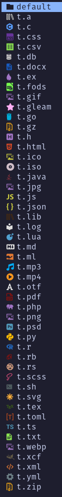
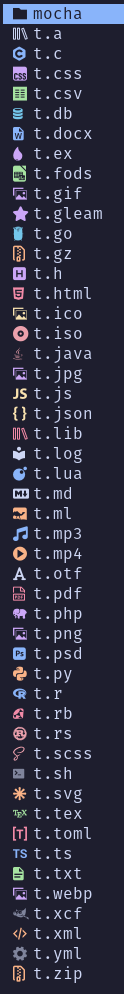
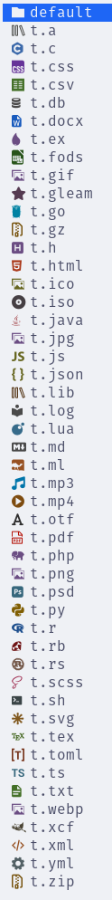
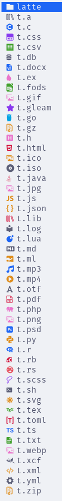

# icons-brew.yazi

Make a hot `theme.toml` for your Yazi icons with your favorite color palette.  
Basically just an adaptation of
[tiny-devicons-auto-colors.nvim](https://github.com/rachartier/tiny-devicons-auto-colors.nvim)
plugin for Yazi.

## Screenshots

<details open>
  <summary>Dark theme</summary>
     
</details>

<details>
  <summary>Light theme</summary>
     
</details>

Observe how the default colors (on the left) have been replaced with
user-provided colors (on the right). The key lies in selecting the nearest
color from the new given palette that matches the original one.

These screenshots were made using the script's default output, which is the
same as the one you can find in the `catppuccin.toml` file. The default config
uses the Mocha and Latte palettes for dark and light themes, respectively.

## On Tap

If you have a taste for [catppuccin
flavors](https://github.com/catppuccin/catppuccin?tab=readme-ov-file#-palette),
just grab the available ready-made theme inside the [catppuccin](/catppuccin)
directory. Rename the file to `theme.toml` and add it to your Yazi
configuration path. This can be done with a single `curl` command.

For the Mocha flavor:

```sh
curl https://raw.githubusercontent.com/lpnh/icons-brew.yazi/main/catppuccin/mocha.toml >> ~/.config/yazi/theme.toml
```

For the Latte flavor:

```sh
curl https://raw.githubusercontent.com/lpnh/icons-brew.yazi/main/catppuccin/latte.toml >> ~/.config/yazi/theme.toml
```

That's it, enjoy!

## Self-service

### Prepare

Use the `dark_colors_table` and `light_colors_table` in the
[config.lua](/config.lua) file to apply the desired color palette. There's also
some other variables you can adjust to change the color matching results.

### Brew

Run the `brew.lua` script and it will generate both dark and light theme files.

```bash
lua brew.lua
```

### Serve

Add the generated file to your Yazi config directory:

```shell
mv theme-dark.toml ~/.config/yazi/theme.toml
```

## Acknowledgement

- [Yazi](https://yazi-rs.github.io) for the amazing — and *Blazing Fast* —
terminal file manager. The `brew.lua` follows the same script found on [Yazi's
repo](https://github.com/sxyazi/yazi/blob/main/scripts/icons/generate.lua).
- [tiny-devicons-auto-colors.nvim](https://github.com/rachartier/tiny-devicons-auto-colors.nvim),
for the algorithm and implementation logic. I.e. everything on the [prepare](/prepare)
path and the `config.lua` file derived from it.
- [nvim-web-devicons](https://github.com/nvim-tree/nvim-web-devicons), for
providing and maintaining the icons we all rely on.
- [catppuccin](https://github.com/catppuccin), for the soothing pastel theme. The
warmest flavors one could ask for.
