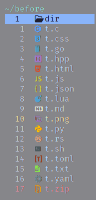
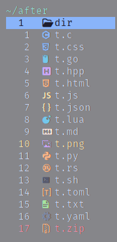

# icons-brew.yazi

Make a hot Yazi `theme.toml` for your icons using your favorite color palette.
Basically just an adaptation of
[tiny-devicons-auto-colors.nvim](https://github.com/rachartier/tiny-devicons-auto-colors.nvim)
plugin for Yazi.

 

## On Tap

Simply grab the ready-made [mocha.toml](/mocha.toml), rename it and add it to
your Yazi config path. That's it, enjoy!
The `mocha.toml` is what you can get by default. It's based on
[catppuccin's Mocha palette](https://github.com/catppuccin/catppuccin?tab=readme-ov-file#-palette).

## Make Your Own

Run the `brew.lua` script and save the output in a `theme.toml` file.

Using Bash:

```bash
lua brew.lua > theme.toml
```

Using Nushell:

```nushell
lua brew.lua | save theme.toml
```

Add the generated file to your Yazi config directory:

```shell
mv theme.toml ~/.config/yazi/theme.toml
```

## Configuration

You can change the color palette and tweak the color matching result using the
[config.lua](/config.lua) file.

## Acknowledgement

- [Yazi](https://yazi-rs.github.io) for the amazing - and *Blazing Fast* -
terminal file manager. The `brew.lua` follows the same script found on [yazi's
repo](https://github.com/sxyazi/yazi/blob/main/scripts/icons/generate.lua).
- [tiny-devicons-auto-colors.nvim](https://github.com/rachartier/tiny-devicons-auto-colors.nvim),
for the algorithm and implementation logic. I.e. everything on the [prepare](/prepare)
path.
- [nvim-web-devicons](https://github.com/nvim-tree/nvim-web-devicons), for
providing and maintaining the icons we all rely on.
- [catppuccin](https://github.com/catppuccin), for the soothing pastel theme. The
warmest flavors one could ask for.
